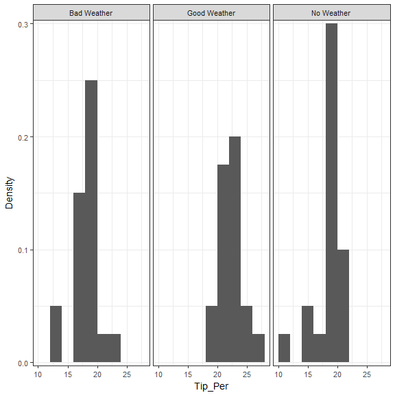

```r
> require("ggplot2")
> .df <- na.omit(data.frame(x = Weather$Tip_Per, s = Weather$Message))
> .nbins <- pretty(range(.df$x), n = nclass.scott(.df$x), min.n = 1)
> .plot <- ggplot(data = .df, aes(x = x, y = ..density..)) + 
+   geom_histogram(breaks = .nbins) + 
+   scale_y_continuous(expand = c(0.01, 0)) + 
+   facet_wrap( ~ s) + 
+   xlab("Tip_Per") + 
+   ylab("Density") + 
+   theme_bw(base_size = 14, base_family = "sans") + 
+   theme(panel.spacing = unit(0.3, "lines"))
> print(.plot)
```



```r
> rm(.df, .nbins, .plot)
```


